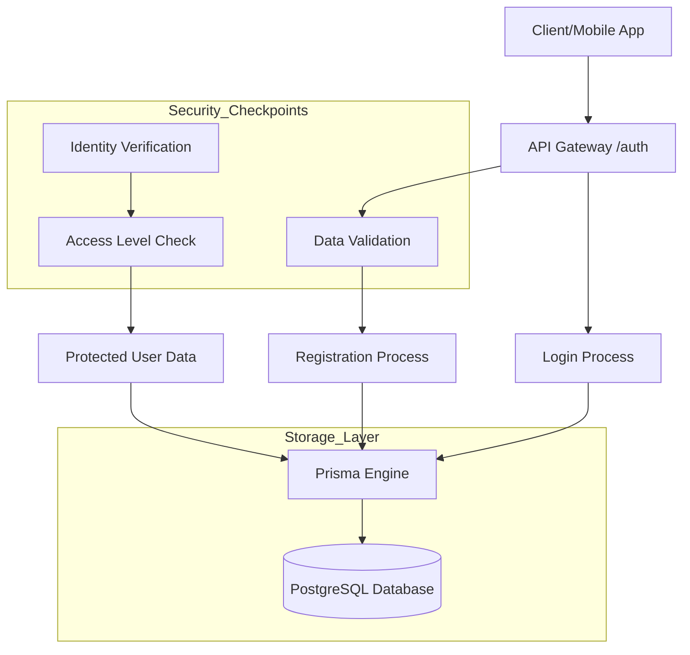
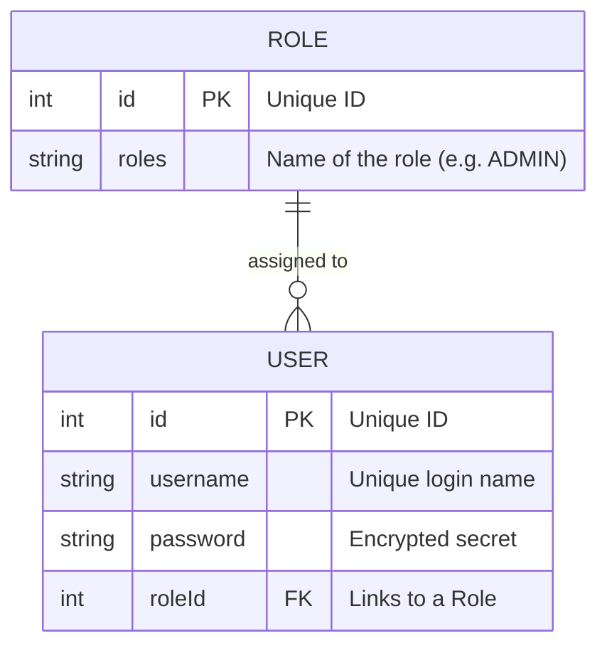
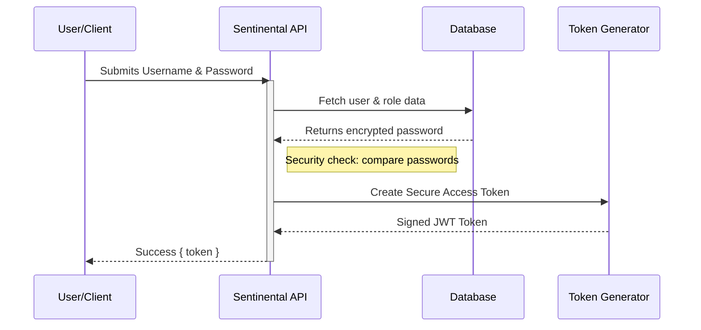

# System Design & Project Overview: Sentinental

## 1. Executive Summary
**Sentinental** is a specialized Authorization Microservice. Its primary purpose is to manage user identities, secure passwords, and control who can access specific parts of a platform using a "Role-Based Access Control" (RBAC) system.

## 2. Key Features
*   **Secure Registration**: Validates user data before saving.
*   **Identity Protection**: Passwords are never stored in plain text.
*   **Role Management**: Supports different access levels (e.g., `USER` vs. `ADMIN`).
*   **Token-Based Access**: Uses modern industry standards (JWT) for session management.

## 3. Technology Stack
*   **Language**: **TypeScript** (Ensures code quality and fewer bugs).
*   **Platform**: **Node.js** with **Express** (Fast and scalable web server).
*   **Database Management**: **Prisma** (A modern tool for safe database communication).
*   **Database**: **PostgreSQL** (Reliable and professional-grade data storage).
*   **Security Tools**: **bcryptjs** for password encryption and **JSON Web Tokens (JWT)** for secure logins.

## 4. High-Level Architecture
The system is built using a "Layered Architecture," meaning each part has one specific job. This makes the code easier to maintain and test.

## 5. Data Relationships
The system manages two main types of information: **Users** and **Roles**. 

## 6. How the Login Process Works
This diagram shows the "behind-the-scenes" steps when a user logs in.

## 7. Security & Compliance
*   **Password Security**: We use "salting and hashing" (bcrypt). Even if a database is compromised, actual passwords remain unreadable.
*   **Access Control**: A user with a `USER` role cannot access the `/users` list; only an `ADMIN` has that privilege.
*   **Environment Safety**: Sensitive configuration (like database passwords and secret keys) is stored in a separate `.env` file and is never uploaded to public version control.
*   **Clean Code Standards**: The project follows **Google’s TypeScript Style (GTS)** to ensure the code is professional, consistent, and easy for any developer to read.

---
